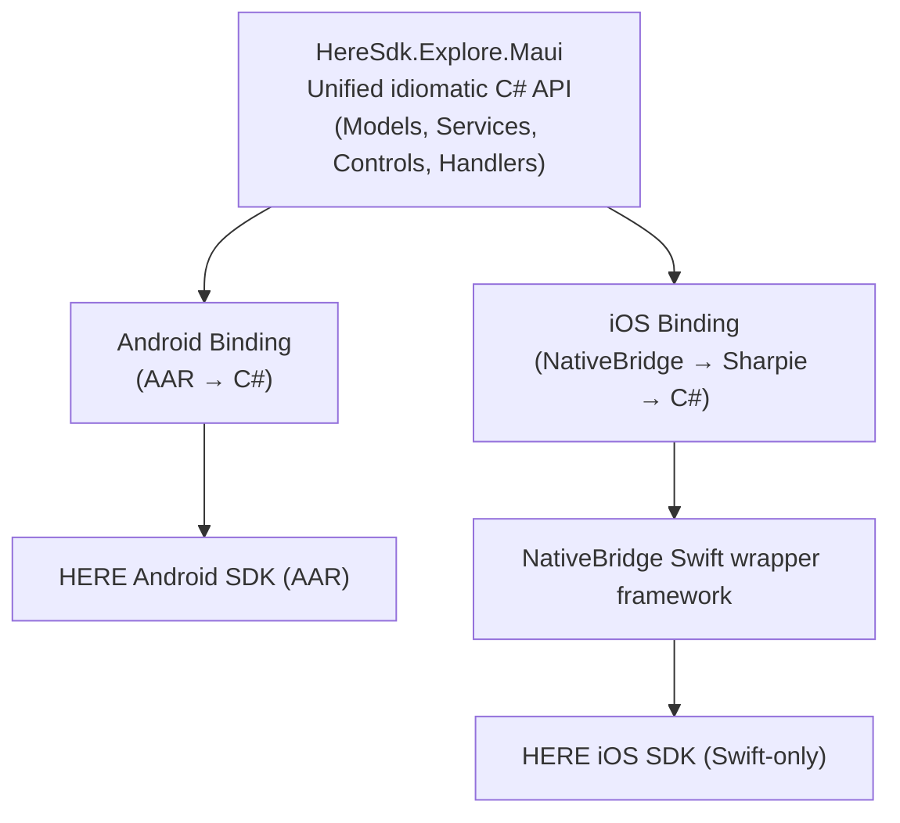

# HERE SDK Explore for .NET MAUI

[](https://github.com/angoratek/here-sdk-for-maui/actions/workflows/build.yml)
[](https://www.nuget.org/packages/HereSdk.Explore.Maui)
[](https://angoratek.github.io/here-sdk-for-maui/)
[](https://github.com/angoratek/here-sdk-for-maui/blob/main/LICENSE)

Cross-platform .NET MAUI bindings for the [HERE SDK](https://www.here.com/) Explore Edition v4.25.5.0, supporting Android (API 24+) and iOS (15.2+).

📖 **[Full documentation](https://angoratek.github.io/here-sdk-for-maui/)** — guides, architecture, and the complete API reference (DocFX).

## Features

- **Unified C# API** — One idiomatic interface for both Android and iOS
- **Map display** — MapView control with camera, gestures, schemes
- **Search** — Text search, category search, auto-suggest, place details with dual-input origin/destination UX
- **Routing** — Car, truck, pedestrian, bicycle, scooter, EV routing with maneuvers and visual route display
- **Traffic** — Real-time traffic flow and incident queries
- **Location** — Device location via `ILocationService` (cross-platform, MAUI Geolocation-based)
- **Map items** — Markers, polylines, polygons, arrows, circles (polygon-approximated), 3D markers

## Prerequisites

- **.NET 10 SDK** — [Download](https://dotnet.microsoft.com/download/dotnet/10.0)
- **.NET MAUI workloads** — `dotnet workload install maui`
- **macOS + Xcode 15+** — Required for iOS binding (Native Library Interop)
- **Android SDK** — API 34+ recommended
- **HERE SDK credentials** — Access Key ID and Secret from [HERE platform](https://developer.here.com/)

## Quick Start

### 1. Install the NuGet package

```xml
<ItemGroup>
  <PackageReference Include="HereSdk.Explore.Maui" Version="4.25.5.0" />
</ItemGroup>
```

### 2. Initialize in `MauiProgram.cs`

```csharp
using Here.Explore.Maui;

builder.UseHereSdkExplore(new HereSdkOptions
{
    AccessKeyId = "YOUR_ACCESS_KEY_ID",
    AccessKeySecret = "YOUR_ACCESS_KEY_SECRET"
});
```

### 3. Add the map to your XAML

```xml
xmlns:here="clr-namespace:Here.Explore.Maui.Controls;assembly=HereSdk.Explore.Maui"

<here:HereMapView
    x:Name="Map"
    MapScheme="NormalDay" />
```

### 4. Use services

```csharp
// Search
var results = await searchService.SearchAsync(
    new TextQuery("coffee nearby"),
    new SearchOptions());

// Routing
var route = await routingService.CalculateRouteAsync(
    new[] { new Waypoint(start), new Waypoint(end) },
    new RoutingOptions(TransportMode: SectionTransportMode.Car));

// Location
var location = await locationService.GetCurrentLocationAsync();
```

## Reference App

The included reference app (`HereSdk.Explore.Maui.RefApp`) shows the library end-to-end: one shared map with overlay panels switched by a bottom tab bar, so routes, markers, and traffic drawn on one panel stay visible on all others.

- **Explore** — Text and category search with autocomplete suggestions, reverse-geocode place card on map tap
- **Directions** — Dual-input origin/destination routing with transport mode picker (car, truck, pedestrian, etc.), maneuver list, and isoline mode
- **Traffic** — Real-time traffic flow overlay with jam-factor color legend, incident list with severity indicators
- **Tools** — Drawing tools (Marker, Polyline, Polygon, Circle) added via tap gestures on the map, demo gallery presets, map style switching (5 schemes), dark mode toggle, Reset Map

## Architecture



### NuGet Packages

| Package | Description |
|---------|-------------|
| `HereSdk.Explore.Maui` | Cross-platform MAUI library (depends on platform bindings) |
| `HereSdk.Explore.Android.Binding` | Android AAR binding |
| `HereSdk.Explore.iOS.Binding` | iOS NativeBridge binding |

Most consumers should reference only `HereSdk.Explore.Maui`.

### Why NativeBridge for iOS?

The iOS HERE SDK is **Swift-only**. Its ObjC bridge header exposes only 4 types — insufficient for binding. We create a Swift wrapper framework (`HereSdk.Explore.iOS.NativeBridge`) that re-exposes all APIs via `@objc` annotations, then bind that with Objective-Sharpie.

This is the standard pattern recommended by the MAUI Community Toolkit for Swift-only SDKs.

## Building from Source

### Android

```bash
# Build Android binding
dotnet build src/HereSdk.Explore.Android.Binding -c Release
```

### iOS

```bash
# Build NativeBridge xcframework (requires Xcode + XcodeGen)
cd src/HereSdk.Explore.iOS.NativeBridge
xcodegen generate
cd ../..
./scripts/build-ios-native.sh

# Run Objective-Sharpie + fix bindings (optional — ApiDefinition.cs is already maintained)
./scripts/bind-ios.sh

# Build iOS binding
dotnet build src/HereSdk.Explore.iOS.Binding -c Release
```

### MAUI Library

```bash
# Build for both platforms
dotnet build src/HereSdk.Explore.Maui -f net10.0-android -c Release
dotnet build src/HereSdk.Explore.Maui -f net10.0-ios -c Release

# Or use the build script
./scripts/build.sh
```

### Reference App

```bash
# Android
dotnet build src/HereSdk.Explore.Maui.RefApp -f net10.0-android -c Debug

# iOS (requires macOS + Xcode)
dotnet build src/HereSdk.Explore.Maui.RefApp -f net10.0-ios -c Debug
```

### Tests

```bash
# Unit tests (no device needed)
dotnet test tests/HereSdk.Explore.Maui.Tests -c Release

# RefApp in-process UI tests (ViewModel commands, control behavior, flows)
dotnet test tests/HereSdk.Explore.Maui.RefApp.UITests -c Release

# Appium Android smoke tests (requires emulator; runs in ui-tests-android.yml)
dotnet test tests/HereSdk.Explore.Maui.UITests -c Release

# Device tests (requires emulator/simulator)
dotnet test tests/HereSdk.Explore.Maui.DeviceTests -f net10.0-android -c Release
dotnet test tests/HereSdk.Explore.Maui.DeviceTests -f net10.0-ios -c Release
```

`scripts/test.sh` runs all four test suites end-to-end.

### Packaging

```bash
# Pack all NuGet packages
./scripts/pack.sh

# Or with a custom version
./scripts/pack.sh 4.25.5.0-beta1
```

Packages are output to `artifacts/`.

## Project Structure

```
here-sdk-for-maui/
├── src/
│   ├── HereSdk.Explore.Android.Binding/       # Android AAR binding
│   ├── HereSdk.Explore.iOS.NativeBridge/       # Swift wrapper (Xcode project)
│   ├── HereSdk.Explore.iOS.Binding/            # iOS C# binding
│   ├── HereSdk.Explore.Maui/                  # Cross-platform MAUI library
│   └── HereSdk.Explore.Maui.RefApp/           # Demo/reference app
├── tests/
│   ├── HereSdk.Explore.Maui.Tests/            # xUnit unit tests (no device)
│   ├── HereSdk.Explore.Maui.RefApp.UITests/   # xUnit in-process VM/control/flow tests
│   ├── HereSdk.Explore.Maui.UITests/          # NUnit Appium Android smoke tests
│   └── HereSdk.Explore.Maui.DeviceTests/      # Platform device tests
├── scripts/                                    # Build, test, pack, docs scripts
├── docs/                                       # DocFX site (rendered to /site by DocFX)
├── Version.props                               # Centralized version numbers
└── tmp/                                        # SDK archives (gitignored; use HERE_SDK_CACHE)
```

## Roadmap

| Phase | Scope | Status |
|-------|-------|--------|
| 0 | Foundation: scaffolding, bindings, build infrastructure | Complete |
| 1 | MapView + SDK Init: map display, camera, gestures, markers | Complete |
| 2 | Search + Routing: full search & routing on both platforms | Complete |
| 3 | Traffic + Advanced: traffic, map items, advanced features | Complete |
| 4 | Polish + NuGet: coverage, packaging, CI/CD, ref app UX | Complete |
| 5 | Documentation: XML docs, DocFX pipeline, how-to guides | Complete |
| 6 | Final Release: pre-release gate, artifacts, GA publish | In Progress |

For per-phase task breakdowns and the live operational backlog see
[PLAN.md](https://github.com/angoratek/here-sdk-for-maui/blob/main/PLAN.md).

## Key Design Decisions

- **Unified API over platform exposure** — Consumers use one C# interface; platform details are hidden
- **Native Library Interop for iOS** — Swift wrapper framework bridges the Swift-only gap
- **MAUI Handler pattern** — For `HereMapView`, not legacy custom renderers
- **Record types for models** — Immutable value types (GeoCoordinates, Route, Waypoint, etc.)
- **Interface-driven services** — `IMapService`, `IRoutingService`, etc. for testability
- **TDD** — Write tests first, then implement

## Known Limitations

- **No Windows/macOS Catalyst support** — HERE SDK is Android + iOS only
- **No CarPlay/Android Auto** in unified API — platform-specific only
- **iOS `RefreshRouteOptions`** is deprecated and will NOT be bound
- **iOS binary size** — xcframework is ~831 MB (stripped for release)
- **macOS required** for building iOS bindings (Xcode dependency)
- **iOS feature gaps**: map pick returns null (NativeBridge search-by-picked-place not yet wrapped)
- **Location service** uses `Microsoft.Maui.Devices.Sensors.Geolocation` as primary source; HERE native positioning not yet exposed in iOS NativeBridge
- **Map circles** are approximated as polygons (HERE SDK has no native circle primitive)

## License

MIT
